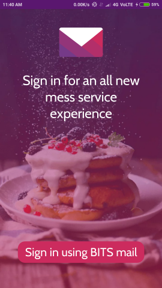
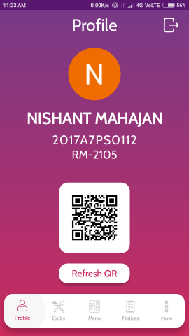
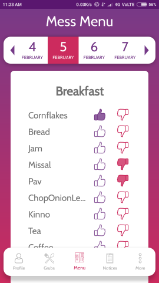
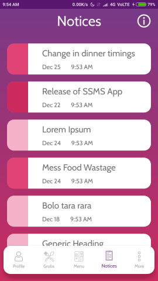
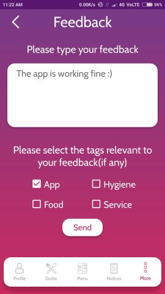
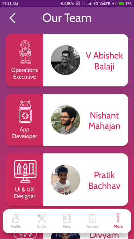

## Overview
This is an Android app which allows students studying in BITS Pilani to perform various mess related activities. It's aim is to streamline the some of the everyday tasks students perform and allow the mess services to receive constructive feedback.

## Features
The app currently offers the following features:
* View mess menu for 15 day periods.
* Upvote and downvote mess menu items. This will give SSMS members valuable data with which they can improve the menu.
* View and manage notices. The notices are categorized into 3 priorities to make it easier to go through them.
* View details for upcoming grubs. Grubs are paid-for dinners usually hosted by a state's cultural association.
* Sign-up for and cancel grubs.
* Use a QR code to enter a grub you've signed-up for instead of carrying a stub/pass with you.
* QR code can be refreshed to prevent mischief if someone else gets a screenshot of your QR code.
* Submit feedback related the app, food, hygiene or service anytime easily.
* Contact numbers and details of SSMS GC members are available.

## Screenshots
The following screenshots were taken on my phone: Redmi Note 4.
 
<a href="https://raw.githubusercontent.com/AnEnigmaticBug/SSMS-App/master/screenshots/s0.png"></img></a>
<a href="https://raw.githubusercontent.com/AnEnigmaticBug/SSMS-App/master/screenshots/s1.png"></img></a>
 
<a href="https://raw.githubusercontent.com/AnEnigmaticBug/SSMS-App/master/screenshots/s2.png"></img></a>
<a href="https://raw.githubusercontent.com/AnEnigmaticBug/SSMS-App/master/screenshots/s3.png"></img></a>
 
<a href="https://raw.githubusercontent.com/AnEnigmaticBug/SSMS-App/master/screenshots/s4.png"></img></a>
<a href="https://raw.githubusercontent.com/AnEnigmaticBug/SSMS-App/master/screenshots/s5.png"></img></a>
 

## Notes
The app uses the package-by-feature structure and uses MVVM(plus some ideas from MVI) as it's architecture pattern. RxJava is used throughout the app for transforming data.

## Roadmap
The following features are planned to be implemented:
* A sick food section. Here, the students will be able to apply for sick food.

## Credits
The UI/UX is done by Pratik Bachhav and the backend is made and handled by Divyam Goel and Raghav Arora. The app is an initiative of V Abishek Balaji.
